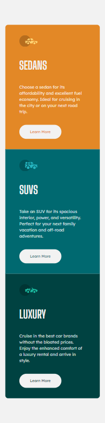

# Frontend Mentor - 3-column preview card component solution

This is a solution to the [3-column preview card component challenge on Frontend Mentor](https://www.frontendmentor.io/challenges/3column-preview-card-component-pH92eAR2-). Frontend Mentor challenges help you improve your coding skills by building realistic projects. 

## Table of contents

- [Overview](#overview)
  - [The challenge](#the-challenge)
  - [Screenshot](#screenshot)
  - [Links](#links)
- [My process](#my-process)
  - [Built with](#built-with)
  - [What I learned](#what-i-learned)
  - [Continued development](#continued-development)
- [Author](#author)

## Overview

### The challenge

Users should be able to:

- View the optimal layout depending on their device's screen size
- See hover states for interactive elements

### Screenshot
#### Final Result:

### Links

- Solution URL: [https://www.frontendmentor.io/solutions/3-column-card-component-built-with-sass-and-flexbox-41em_UWHV](https://www.frontendmentor.io/solutions/3-column-card-component-built-with-sass-and-flexbox-41em_UWHV)
- Live Site URL: [https://cristianescs.github.io/3-column-preview-card-component-main/](https://cristianescs.github.io/3-column-preview-card-component-main/)

## My process

### Built with

- CSS custom properties
- SASS
- Flexbox
- Mobile-first workflow

### What I learned

I could learn how to develop a website doing for mobile first. 

### Continued development

It was the first time that I tried to develop a website doing for mobile first so I had difficulties in the beggining,  how I'm still not used with this so I want to keep studying to improve my skills.

## Author

- Frontend Mentor - [@cristianescs ](https://www.frontendmentor.io/profile/cristianescs)

